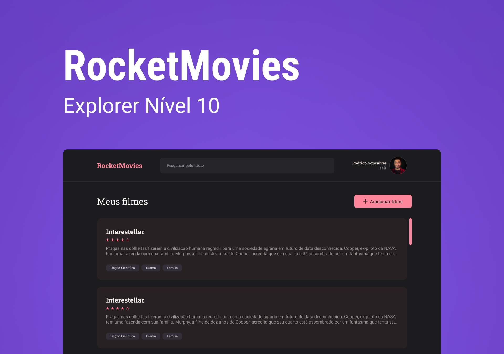

<h1 align="center">
   🎞 Rocketmovies Frontend
</h1>

<p align="center">
  
  <a href="https://www.linkedin.com/in/pedro-afonso-lkdn/"></a>
  <br/>
  
  
  
  
  
</p>

<h1 align="center">
    
</h1>

## :open_book: About

This project is the front-end from the RocketMovies project, an application made to store your fav movies.
The user can do the login using his credentials or creating a new user to sign in into the application.

To test the application you can use this credentials:
- user: user@gmail.com
- password: 123456

## :gear: Features

- [x] Login;
- [x] Create account;
- [x] Show saved movies;
- [x] Save a new movie;
- [x] Show details from a movie;
- [x] Show profile;
- [x] Update profile;

## 🧰 Tools

- **ReactJS** - build interfaces;
- **React-router-dom** - map the routes;
- **JS** - application logic;
- **Styled Components** - application stylization;
- **Axios** - connect with the API.
- **Vite** - build the project;
- **NPM** - install dependencies;

## 🎬 How it works
### 🖥️ Web version

<div style="display:flex; flex-direction: row">
  
</div>

### 📲 Mobile Food Explorer 
<div style="display:flex; flex-direction: row">
  
</div>

## 🚀 Getting started

Clone Project and access folder and start the server it is necessary to have NodeJs, Git
installed and Visual Studio Code.

### Programs needed to Getting started

- [NodeJS](https://nodejs.org/en/)
- [Visual Studio Code - Vscode](https://code.visualstudio.com/)
- [Git](https://git-scm.com/)

This project is divided into two parts:
1. [Backend - api-food-explorer](https://github.com/Pedro558/RocketMoviesAPI) 
2. Frontend (this repository)

💡 The Frontend needs the Backend to be running to work.

### Install server and start up

```bash
  # Clone the API repository
  $ git clone https://github.com/Pedro558/Rocketmovies-front-end.git
```

```bash
  # Change to the repository
  $ cd rocketmovies-frontend/
```

```bash
  # Install depen
  $ npm install
```

```bash
  # Install local server
  $ npm run dev
```

```bash
  # You should got this message
  VITE v3.0.9  ready in 1989 ms

  ➜  Local:   http://127.0.0.1:5173/
  ➜  Network: use --host to expose
```

- Now open the browser in the `Local` address to test the application

---

## 🦸‍♂️ Author
<p>
 <sub><strong>🌟 Pedro Afonso🌟</strong></sub>
</p>

>This project was made with ❤️ by **[Pedro Afonso](https://www.linkedin.com/in/pedro-afonso-lkdn/)**
